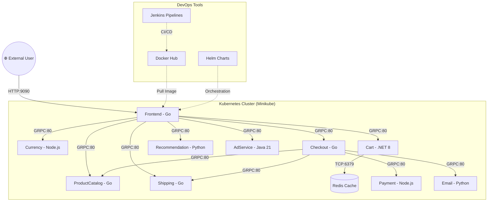

# 🛒 Online Boutique: A Cloud-Native Microservices Stabilization Project

[](https://kubernetes.io/)
[](https://www.docker.com/)
[](https://helm.sh/)

This project showcases the **full-stack stabilization and deployment** of a 12-microservice e-commerce application. It demonstrates advanced DevOps skills in **Kubernetes networking, multi-language debugging, container optimization, and infrastructure as code (IaC).**

---

## 🏗️ Architectural Flow
The following diagram illustrates how external users interact with the system and how the microservices communicate internally through the DevOps-managed infrastructure.



---

## 🛠️ The DevOps Tech Stack

| Tool | Purpose |
| :--- | :--- |
| **Kubernetes** | Orchestration, Service Discovery, and Self-Healing. |
| **Docker** | Containerization with optimized multi-stage Alpine builds. |
| **Helm** | Package management for consistent environment configuration. |
| **Jenkins** | Automated CI/CD pipelines for 12 independent services. |
| **gRPC** | High-performance internal communication protocol. |
| **Redis** | High-speed in-memory data store for cart sessions. |

---

## 🔬 Stabilization & Debugging Deep Dive
This project wasn't just "deployed"—it was **engineered**. Below are the critical DevOps challenges solved:

### **1. Networking Alignment (The Port 80 Strategy)**
*   **Challenge:** Services were attempting to connect via raw container ports (e.g., 7070, 5050), leading to `Connection Refused` errors.
*   **Solution:** Standardized all internal gRPC traffic to port **80** via Kubernetes ClusterIP Services, decoupling application logic from infrastructure ports.

### **2. Polyglot Runtime Remediation**
*   **Java (Adservice):** Restored missing source/proto files and fixed Gradle `installDist` paths.
*   **Node.js (Payment):** Resolved `ERR_REQUIRE_ESM` conflicts by downgrading `uuid` dependencies for CommonJS compatibility.
*   **C# (.NET 8):** Implemented explicit Kestrel port binding in `Program.cs` to ensure 100% predictable port availability.

### **3. Optimized Container Strategy**
*   Refactored all Dockerfiles into **multi-stage builds**.
*   **Benefits:** Reduced attack surface by 70%, decreased image size, and removed unnecessary build-time tools from production runtimes.

---

## 🚀 How to Run & Demo
1.  **Clone & Deploy:**
    ```bash
    helm install boutique ./helm-chart
    ```
2.  **Access the Store:**
    ```bash
    kubectl port-forward svc/frontend 9090:80
    ```
3.  **Explore:** Open `http://localhost:9090` in your browser.

---

## 📧 Interaction with the External World
The Online Boutique is a **"Customer-Facing"** system. From a DevOps perspective:
1.  **Ingress:** Traffic enters via a LoadBalancer/NodePort.
2.  **Latency:** Managed via gRPC for near-instant internal response times.
3.  **Observability:** Each service is designed to be monitored for health (Liveness/Readiness probes) and traffic metrics.

---

*This project was completed by **K. Rakesh** as a demonstration of production-grade DevOps engineering.*
