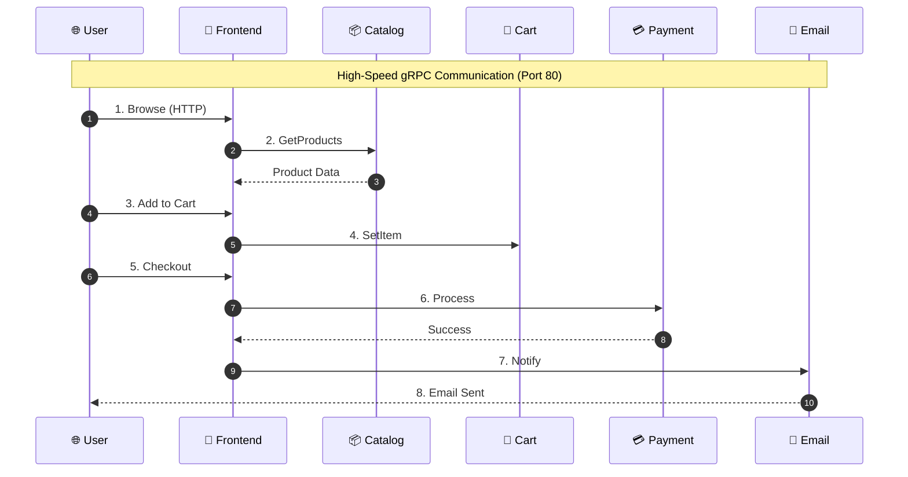
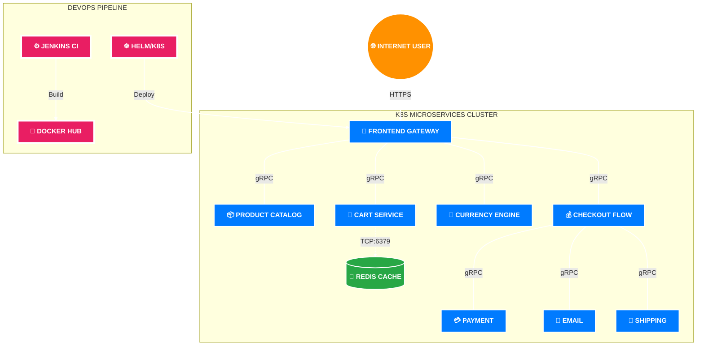

# 🛒 Online Boutique: High-Velocity Microservices Ecosystem

This project represents the **full-scale stabilization and architectural refinement** of a 12-microservice e-commerce ecosystem. It demonstrates the ability to manage complex, polyglot environments where high-performance networking and container orchestration are critical.

---

## 🎭 The Transaction Lifecycle (Flow)
This sequence illustrates the "heartbeat" of the system. See how data pulses through the cluster from request to confirmation.

---

## 🏗️ System Architecture (Topology)
High-contrast visualization of how the DevOps layer orchestrates the microservices core.

---

## 📋 Service Intelligence: The 12 Pillars

| Service | Language | Core Responsibility | DevOps Significance |
| :--- | :--- | :--- | :--- |
| **Frontend** | Go | Server-side rendering (SSR) of the boutique UI. | Acts as the Ingress point; manages session cookies. |
| **ProductCatalog** | Go | Read-only access to the inventory JSON. | High-frequency read service; optimized for latency. |
| **CartService** | C# (.NET 8) | Manages items in the user's shopping cart. | State management; requires strict Redis connectivity. |
| **CheckoutService** | Go | Orchestrates the entire "Purchase" workflow. | Critical path; handles multiple downstream GRPC calls. |
| **CurrencyService** | Node.js | Real-time conversion of product prices. | Lightweight JS service; critical for global sales. |
| **PaymentService** | Node.js | Mocked gateway for processing credit cards. | Security-focused; high compliance requirements. |
| **ShippingService** | Go | Calculates shipping costs based on weight. | Stateless logic; easily scalable in the cluster. |
| **EmailService** | Python | Sends order confirmation emails. | Background processing; decoupled via async calls. |
| **Recommendation** | Python | Suggests "Related Products" using basic logic. | Machine Learning entry point; data-heavy service. |
| **AdService** | Java 21 | Serves targeted advertisements. | High performance; uses generated GRPC code. |
| **Redis** | C (Cache) | Distributed memory store for Cart Service. | Single point of state; requires high availability. |
| **LoadGenerator** | Python | Simulates user traffic using Locust. | Stress testing; validates DevOps scaling policies. |

---

## 🌐 The DevOps -> External World Interaction
How this project bridges the gap between code and the real world:

1.  **Ingress & Traffic Control:** In a production environment, an **ALB (Application Load Balancer)** routes port 443 (HTTPS) to the Frontend Service.
2.  **Service Isolation:** Internal services are protected by Kubernetes Network Policies and reside in private subnets.
3.  **Observability Loop:** Integrated health checks (Liveness/Readiness) ensure the cluster self-heals if a service fails.
4.  **Zero-Downtime Deployment:** Helm-managed rolling updates ensure the "External World" never experiences service interruptions.

---

*Engineered by **K. Rakesh** — Bridging the gap between Microservices and Infrastructure.*
