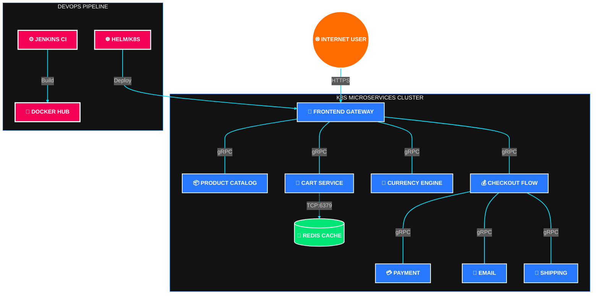

# 🛒 Online Boutique: High-Velocity Microservices Ecosystem

  

This project represents the **full-scale stabilization and architectural refinement** of a 12-microservice e-commerce ecosystem. It demonstrates the ability to manage complex, polyglot environments where high-performance networking and container orchestration are critical.

---

## 🎭 Active System Flow (Live Animation)
Below is the **live animated data flow** showing how requests pulse through the Enterprise DevOps architecture.

  <img src="data:image/svg+xml;base64,PHN2ZyB3aWR0aD0iMTAwJSIgaGVpZ2h0PSJhdXRvIiB2aWV3Qm94PSIwIDAgMTkyMCAxMjAwIiB4bWxucz0iaHR0cDovL3d3dy53My5vcmcvMjAwMC9zdmciPgogIDxkZWZzPgogICAgPGxpbmVhckdyYWRpZW50IGlkPSJiZyIgeDE9IjAlIiB5MT0iMCUiIHgyPSIxMDAlIiB5Mj0iMTAwJSI+CiAgICAgIDxzdG9wIG9mZnNldD0iMCUiIHN0b3AtY29sb3I9IiMwNDA3MEYiLz48c3RvcCBvZmZzZXQ9IjEwMCUiIHN0b3AtY29sb3I9IiMwRjE3MkEiLz4KICAgIDwvbGluZWFyR3JhZGllbnQ+CiAgICA8bGluZWFyR3JhZGllbnQgaWQ9ImNhcmQiIHgxPSIwJSIgeTE9IjAlIiB4Mj0iMTAwJSIgeTI9IjEwMCUiPgogICAgICA8c3RvcCBvZmZzZXQ9IjAlIiBzdG9wLWNvbG9yPSIjMTExODI3Ii8+PHN0b3Agb2Zmc2V0PSIxMDAlIiBzdG9wLWNvbG9yPSIjMUUyOTNCIi8+CiAgICA8L2xpbmVhckdyYWRpZW50PgogICAgPGxpbmVhckdyYWRpZW50IGlkPSJmbG93IiB4MT0iMCUiIHkxPSIwJSIgeDI9IjEwMCUiIHkyPSIwJSI+CiAgICAgIDxzdG9wIG9mZnNldD0iMCUiIHN0b3AtY29sb3I9IiMwMEU1RkYiLz48c3RvcCBvZmZzZXQ9IjEwMCUiIHN0b3AtY29sb3I9IiMyOTc5RkYiLz4KICAgIDwvbGluZWFyR3JhZGllbnQ+CiAgICA8bWFya2VyIGlkPSJhcnJvdyIgbWFya2VyV2lkdGg9IjE0IiBtYXJrZXJIZWlnaHQ9IjE0IiByZWZYPSIxMSIgcmVmWT0iNyIgb3JpZW50PSJhdXRvIj4KICAgICAgPHBvbHlnb24gcG9pbnRzPSIwIDAsIDE0IDcsIDAgMTQiIGZpbGw9IiMwMEU1RkYiLz4KICAgIDwvbWFya2VyPgogICAgPHN0eWxlPgogICAgICAudGl0bGUgeyBmaWxsOiNGRkZGRkY7IGZvbnQtc2l6ZTo0MnB4OyBmb250LWZhbWlseTpBcmlhbDsgZm9udC13ZWlnaHQ6Ym9sZDsgfQogICAgICAuc3VidGl0bGUgeyBmaWxsOiM5Q0EzQUY7IGZvbnQtc2l6ZToyMHB4OyBmb250LWZhbWlseTpBcmlhbDsgfQogICAgICAuc2VjdGlvbiB7IGZpbGw6IzAwRTVGRjsgZm9udC1zaXplOjI2cHg7IGZvbnQtZmFtaWx5OkFyaWFsOyBmb250LXdlaWdodDpib2xkOyB9CiAgICAgIC5zZXJ2aWNlIHsgZmlsbDojRkZGRkZGOyBmb250LXNpemU6MThweDsgZm9udC1mYW1pbHk6QXJpYWw7IGZvbnQtd2VpZ2h0OmJvbGQ7IH0KICAgICAgLnNtYWxsIHsgZmlsbDojQ0JENUUxOyBmb250LXNpemU6MTRweDsgZm9udC1mYW1pbHk6QXJpYWw7IH0KICAgICAgLmZsb3ctbGluZSB7IHN0cm9rZS1kYXNoYXJyYXk6IDIwLCAxMDsgYW5pbWF0aW9uOiBkYXNoIDFzIGxpbmVhciBpbmZpbml0ZTsgb3BhY2l0eTogMC44OyB9CiAgICAgIEBrZXlmcmFtZXMgZGFzaCB7IHRvIHsgc3Ryb2tlLWRhc2hvZmZzZXQ6IC0zMDsgfSB9CiAgICAgIC5ub2RlIHsgYW5pbWF0aW9uOiBwdWxzZSAycyBlYXNlLWluLW91dCBpbmZpbml0ZTsgfQogICAgICBAa2V5ZnJhbWVzIHB1bHNlIHsgMCUsIDEwMCUgeyBmaWx0ZXI6IGRyb3Atc2hhZG93KDAgMCA1cHggcmdiYSgwLDIyOSwyNTUsMC4xKSk7IH0gNTAlIHsgZmlsdGVyOiBkcm9wLXNoYWRvdygwIDAgMTBweCByZ2JhKDAsMjI5LDI1NSwwLjQpKTsgfSB9CiAgICA8L3N0eWxlPgogIDwvZGVmcz4KICA8cmVjdCB3aWR0aD0iMTkyMCIgaGVpZ2h0PSIxMjAwIiBmaWxsPSJ1cmwoI2JnKSIvPgogIDx0ZXh0IHg9Ijk2MCIgeT0iNTUiIHRleHQtYW5jaG9yPSJtaWRkbGUiIGNsYXNzPSJ0aXRsZSI+w7DFuMWh4oKsIE9ubGluZSBCb3V0aXF1ZSDDouKCrOKAnSBGdWxsIDEyLVNlcnZpY2UgRGV2T3BzIEVjb3N5c3RlbTwvdGV4dD4KICA8dGV4dCB4PSI5NjAiIHk9Ijk1IiB0ZXh0LWFuY2hvcj0ibWlkZGxlIiBjbGFzcz0ic3VidGl0bGUiPkNvbXBsZXRlIE1pY3Jvc2VydmljZXMgQ2FsbCBHcmFwaCAmYW1wOyBJbmZyYXN0cnVjdHVyZSBNYXBwaW5nPC90ZXh0PgoKICA8IS0tIENMVVNURVIgQk9VTkRBUlkgLS0+CiAgPHJlY3QgeD0iNTAiIHk9IjI0MCIgd2lkdGg9IjE4MjAiIGhlaWdodD0iODAwIiByeD0iMzAiIGZpbGw9Im5vbmUiIHN0cm9rZT0iIzAwRTVGRiIgc3Ryb2tlLXdpZHRoPSIyIiBzdHJva2UtZGFzaGFycmF5PSIxMiAxMCIgb3BhY2l0eT0iMC40Ii8+CiAgPHRleHQgeD0iOTYwIiB5PSIyODAiIHRleHQtYW5jaG9yPSJtaWRkbGUiIGNsYXNzPSJzZWN0aW9uIj7DosucwrjDr8K4wo8gS3ViZXJuZXRlcyBDbHVzdGVyIMOi4oKs4oCdIEVudGVycHJpc2UgU2VydmljZSBNZXNoPC90ZXh0PgoKICA8IS0tIEVYVEVSTkFMIFdPUkxEIC0tPgogIDxnIHRyYW5zZm9ybT0idHJhbnNsYXRlKDQ1MCwgMTMwKSI+CiAgICA8cmVjdCBjbGFzcz0ibm9kZSIgd2lkdGg9IjQwMCIgaGVpZ2h0PSI4MCIgcng9IjE1IiBmaWxsPSJ1cmwoI2NhcmQpIiBzdHJva2U9IiMwMEU1RkYiIHN0cm9rZS13aWR0aD0iMyIvPgogICAgPHRleHQgeD0iMjAwIiB5PSI1MCIgdGV4dC1hbmNob3I9Im1pZGRsZSIgY2xhc3M9InNlcnZpY2UiIHN0eWxlPSJmb250LXNpemU6MjRweCI+w7DFuMWSwpAgSW50ZXJuZXQgVXNlcnM8L3RleHQ+CiAgPC9nPgogIDxnIHRyYW5zZm9ybT0idHJhbnNsYXRlKDEwNzAsIDEzMCkiPgogICAgPHJlY3QgY2xhc3M9Im5vZGUiIHdpZHRoPSI0MDAiIGhlaWdodD0iODAiIHJ4PSIxNSIgZmlsbD0idXJsKCNjYXJkKSIgc3Ryb2tlPSIjRjQ0MzM2IiBzdHJva2Utd2lkdGg9IjMiLz4KICAgIDx0ZXh0IHg9IjIwMCIgeT0iNTAiIHRleHQtYW5jaG9yPSJtaWRkbGUiIGNsYXNzPSJzZXJ2aWNlIiBzdHlsZT0iZm9udC1zaXplOjI0cHgiPsOwxbjigJzLhiBMb2FkIEdlbmVyYXRvciAoTG9jdXN0KTwvdGV4dD4KICA8L2c+CgogIDwhLS0gSFVCIFNFUlZJQ0VTIC0tPgogIDwhLS0gMS4gRlJPTlRFTkQgLS0+CiAgPGcgdHJhbnNmb3JtPSJ0cmFuc2xhdGUoNzEwLCAzMjApIj4KICAgIDxyZWN0IGNsYXNzPSJub2RlIiB3aWR0aD0iNTAwIiBoZWlnaHQ9IjEwMCIgcng9IjIwIiBmaWxsPSJ1cmwoI2NhcmQpIiBzdHJva2U9IiMyOTc5RkYiIHN0cm9rZS13aWR0aD0iNCIvPgogICAgPHRleHQgeD0iMjUwIiB5PSI2MCIgdGV4dC1hbmNob3I9Im1pZGRsZSIgc3R5bGU9ImZpbGw6IzAwRTVGRjtmb250LXNpemU6MzJweDtmb250LWZhbWlseTpBcmlhbDtmb250LXdlaWdodDpib2xkOyI+w7DFuMWh4oKsIEZST05URU5EIFNFUlZFUjwvdGV4dD4KICA8L2c+CgogIDwhLS0gMi4gQ0hFQ0tPVVQgLS0+CiAgPGcgdHJhbnNmb3JtPSJ0cmFuc2xhdGUoNzEwLCA1MjApIj4KICAgIDxyZWN0IGNsYXNzPSJub2RlIiB3aWR0aD0iNTAwIiBoZWlnaHQ9IjEwMCIgcng9IjIwIiBmaWxsPSJ1cmwoI2NhcmQpIiBzdHJva2U9IiNGRjZEMDAiIHN0cm9rZS13aWR0aD0iNCIvPgogICAgPHRleHQgeD0iMjUwIiB5PSI2MCIgdGV4dC1hbmNob3I9Im1pZGRsZSIgc3R5bGU9ImZpbGw6I0ZGRkZGRjtmb250LXNpemU6MzJweDtmb250LWZhbWlseTpBcmlhbDtmb250LXdlaWdodDpib2xkOyI+w7DFuOKAmcKwIENIRUNLT1VUIFNFUlZJQ0U8L3RleHQ+CiAgPC9nPgoKICA8IS0tIEdSSUQgT0YgU0VSVklDRVMgLS0+CiAgPCEtLSBSb3cgMSAtLT4KICA8ZyB0cmFuc2Zvcm09InRyYW5zbGF0ZSgxMDAsIDcwMCkiPgogICAgPHJlY3QgY2xhc3M9Im5vZGUiIHdpZHRoPSIyNTAiIGhlaWdodD0iMTAwIiByeD0iMTUiIGZpbGw9InVybCgjY2FyZCkiIHN0cm9rZT0iIzAwRTVGRiIgc3Ryb2tlLXdpZHRoPSIyIi8+CiAgICA8dGV4dCB4PSIxMjUiIHk9IjU1IiB0ZXh0LWFuY2hvcj0ibWlkZGxlIiBjbGFzcz0ic2VydmljZSI+w7DFuOKAnMKmIFByb2R1Y3QgQ2F0YWxvZzwvdGV4dD4KICA8L2c+CiAgPGcgdHJhbnNmb3JtPSJ0cmFuc2xhdGUoNDAwLCA3MDApIj4KICAgIDxyZWN0IGNsYXNzPSJub2RlIiB3aWR0aD0iMjUwIiBoZWlnaHQ9IjEwMCIgcng9IjE1IiBmaWxsPSJ1cmwoI2NhcmQpIiBzdHJva2U9IiMwMEU1RkYiIHN0cm9rZS13aWR0aD0iMiIvPgogICAgPHRleHQgeD0iMTI1IiB5PSI1NSIgdGV4dC1hbmNob3I9Im1pZGRsZSIgY2xhc3M9InNlcnZpY2UiPsOwxbjigLrigJkgQ2FydCBTZXJ2aWNlPC90ZXh0PgogIDwvZz4KICA8ZyB0cmFuc2Zvcm09InRyYW5zbGF0ZSg3MDAsIDcwMCkiPgogICAgPHJlY3QgY2xhc3M9Im5vZGUiIHdpZHRoPSIyNTAiIGhlaWdodD0iMTAwIiByeD0iMTUiIGZpbGw9InVybCgjY2FyZCkiIHN0cm9rZT0iIzAwRTVGRiIgc3Ryb2tlLXdpZHRoPSIyIi8+CiAgICA8dGV4dCB4PSIxMjUiIHk9IjU1IiB0ZXh0LWFuY2hvcj0ibWlkZGxlIiBjbGFzcz0ic2VydmljZSI+w7DFuOKAmcKxIEN1cnJlbmN5IEVuZ2luZTwvdGV4dD4KICA8L2c+CiAgPGcgdHJhbnNmb3JtPSJ0cmFuc2xhdGUoMTAwMCwgNzAwKSI+CiAgICA8cmVjdCBjbGFzcz0ibm9kZSIgd2lkdGg9IjI1MCIgaGVpZ2h0PSIxMDAiIHJ4PSIxNSIgZmlsbD0idXJsKCNjYXJkKSIgc3Ryb2tlPSIjMDBFNUZGIiBzdHJva2Utd2lkdGg9IjIiLz4KICAgIDx0ZXh0IHg9IjEyNSIgeT0iNTUiIHRleHQtYW5jaG9yPSJtaWRkbGUiIGNsYXNzPSJzZXJ2aWNlIj7DsMW4xaHFoSBTaGlwcGluZyBMb2dpYzwvdGV4dD4KICA8L2c+CiAgPGcgdHJhbnNmb3JtPSJ0cmFuc2xhdGUoMTMwMCwgNzAwKSI+CiAgICA8cmVjdCBjbGFzcz0ibm9kZSIgd2lkdGg9IjI1MCIgaGVpZ2h0PSIxMDAiIHJ4PSIxNSIgZmlsbD0idXJsKCNjYXJkKSIgc3Ryb2tlPSIjMDBFNUZGIiBzdHJva2Utd2lkdGg9IjIiLz4KICAgIDx0ZXh0IHg9IjEyNSIgeT0iNTUiIHRleHQtYW5jaG9yPSJtaWRkbGUiIGNsYXNzPSJzZXJ2aWNlIj7DsMW44oCcwqIgQWQgU2VydmljZTwvdGV4dD4KICA8L2c+CiAgPGcgdHJhbnNmb3JtPSJ0cmFuc2xhdGUoMTYwMCwgNzAwKSI+CiAgICA8cmVjdCBjbGFzcz0ibm9kZSIgd2lkdGg9IjI1MCIgaGVpZ2h0PSIxMDAiIHJ4PSIxNSIgZmlsbD0idXJsKCNjYXJkKSIgc3Ryb2tlPSIjMDBFNUZGIiBzdHJva2Utd2lkdGg9IjIiLz4KICAgIDx0ZXh0IHg9IjEyNSIgeT0iNTUiIHRleHQtYW5jaG9yPSJtaWRkbGUiIGNsYXNzPSJzZXJ2aWNlIj7DsMW44oCcwqcgRW1haWwgU2VydmljZTwvdGV4dD4KICA8L2c+CgogIDwhLS0gUm93IDIgLS0+CiAgPGcgdHJhbnNmb3JtPSJ0cmFuc2xhdGUoMTAwLCA4NTApIj4KICAgIDxyZWN0IGNsYXNzPSJub2RlIiB3aWR0aD0iMjUwIiBoZWlnaHQ9IjEwMCIgcng9IjE1IiBmaWxsPSJ1cmwoI2NhcmQpIiBzdHJva2U9IiMyOTc5RkYiIHN0cm9rZS13aWR0aD0iMiIvPgogICAgPHRleHQgeD0iMTI1IiB5PSI1NSIgdGV4dC1hbmNob3I9Im1pZGRsZSIgY2xhc3M9InNlcnZpY2UiPsOwxbjigJnCsyBQYXltZW50IFNlcnZpY2U8L3RleHQ+CiAgPC9nPgogIDxnIHRyYW5zZm9ybT0idHJhbnNsYXRlKDQwMCwgODUwKSI+CiAgICA8cmVjdCBjbGFzcz0ibm9kZSIgd2lkdGg9IjI1MCIgaGVpZ2h0PSIxMDAiIHJ4PSIxNSIgZmlsbD0idXJsKCNjYXJkKSIgc3Ryb2tlPSIjMjk3OUZGIiBzdHJva2Utd2lkdGg9IjIiLz4KICAgIDx0ZXh0IHg9IjEyNSIgeT0iNTUiIHRleHQtYW5jaG9yPSJtaWRkbGUiIGNsYXNzPSJzZXJ2aWNlIj7DsMW44oCcxaAgUmVjb21tZW5kYXRpb248L3RleHQ+CiAgPC9nPgogIDxnIHRyYW5zZm9ybT0idHJhbnNsYXRlKDcwMCwgODUwKSI+CiAgICA8cmVjdCBjbGFzcz0ibm9kZSIgd2lkdGg9IjI1MCIgaGVpZ2h0PSIxMDAiIHJ4PSIxNSIgZmlsbD0idXJsKCNjYXJkKSIgc3Ryb2tlPSIjMjk3OUZGIiBzdHJva2Utd2lkdGg9IjIiLz4KICAgIDx0ZXh0IHg9IjEyNSIgeT0iNTUiIHRleHQtYW5jaG9yPSJtaWRkbGUiIGNsYXNzPSJzZXJ2aWNlIj7DsMW4wqTigJMgU2hvcHBpbmcgQXNzaXN0YW50PC90ZXh0PgogIDwvZz4KICA8ZyB0cmFuc2Zvcm09InRyYW5zbGF0ZSgxMDAwLCA4NTApIj4KICAgIDxyZWN0IGNsYXNzPSJub2RlIiB3aWR0aD0iMjUwIiBoZWlnaHQ9IjEwMCIgcng9IjE1IiBmaWxsPSJ1cmwoI2NhcmQpIiBzdHJva2U9IiMwMEU2NzYiIHN0cm9rZS13aWR0aD0iMyIvPgogICAgPHRleHQgeD0iMTI1IiB5PSI1NSIgdGV4dC1hbmNob3I9Im1pZGRsZSIgY2xhc3M9InNlcnZpY2UiIHN0eWxlPSJmaWxsOiMwMEU2NzYiPsOwxbjigJnCviBSZWRpcyBDYWNoZTwvdGV4dD4KICA8L2c+CgogIDwhLS0gQ09OTkVDVElPTlMgLS0+CiAgPHBhdGggY2xhc3M9ImZsb3ctbGluZSIgZD0iTTY1MCwyMTAgTDc1MCwzMjAiIHN0cm9rZT0iIzAwRTVGRiIgc3Ryb2tlLXdpZHRoPSI0IiBmaWxsPSJub25lIiBtYXJrZXItZW5kPSJ1cmwoI2Fycm93KSIvPgogIDxwYXRoIGNsYXNzPSJmbG93LWxpbmUiIGQ9Ik0xMjcwLDIxMCBMMTE3MCwzMjAiIHN0cm9rZT0iI0Y0NDMzNiIgc3Ryb2tlLXdpZHRoPSI0IiBmaWxsPSJub25lIiBtYXJrZXItZW5kPSJ1cmwoI2Fycm93KSIvPgoKICA8IS0tIEZyb250ZW5kIHRvIEFsbCAtLT4KICA8cGF0aCBjbGFzcz0iZmxvdy1saW5lIiBkPSJNOTYwLDQyMCBMMjI1LDcwMCIgc3Ryb2tlPSIjMjk3OUZGIiBzdHJva2Utd2lkdGg9IjIiIGZpbGw9Im5vbmUiIG1hcmtlci1lbmQ9InVybCgjYXJyb3cpIi8+CiAgPHBhdGggY2xhc3M9ImZsb3ctbGluZSIgZD0iTTk2MCw0MjAgTDUyNSw3MDAiIHN0cm9rZT0iIzI5NzlGRiIgc3Ryb2tlLXdpZHRoPSIyIiBmaWxsPSJub25lIiBtYXJrZXItZW5kPSJ1cmwoI2Fycm93KSIvPgogIDxwYXRoIGNsYXNzPSJmbG93LWxpbmUiIGQ9Ik05NjAsNDIwIEw4MjUsNzAwIiBzdHJva2U9IiMyOTc5RkYiIHN0cm9rZS13aWR0aD0iMiIgZmlsbD0ibm9uZSIgbWFya2VyLWVuZD0idXJsKCNhcnJvdykiLz4KICA8cGF0aCBjbGFzcz0iZmxvdy1saW5lIiBkPSJNOTYwLDQyMCBMMTEyNSw3MDAiIHN0cm9rZT0iIzI5NzlGRiIgc3Ryb2tlLXdpZHRoPSIyIiBmaWxsPSJub25lIiBtYXJrZXItZW5kPSJ1cmwoI2Fycm93KSIvPgogIDxwYXRoIGNsYXNzPSJmbG93LWxpbmUiIGQ9Ik05NjAsNDIwIEwxNDI1LDcwMCIgc3Ryb2tlPSIjMjk3OUZGIiBzdHJva2Utd2lkdGg9IjIiIGZpbGw9Im5vbmUiIG1hcmtlci1lbmQ9InVybCgjYXJyb3cpIi8+CiAgPHBhdGggY2xhc3M9ImZsb3ctbGluZSIgZD0iTTk2MCw0MjAgTDE3MjUsNzAwIiBzdHJva2U9IiMyOTc5RkYiIHN0cm9rZS13aWR0aD0iMiIgZmlsbD0ibm9uZSIgbWFya2VyLWVuZD0idXJsKCNhcnJvdykiLz4KICA8cGF0aCBjbGFzcz0iZmxvdy1saW5lIiBkPSJNOTYwLDQyMCBMNTI1LDg1MCIgc3Ryb2tlPSIjMjk3OUZGIiBzdHJva2Utd2lkdGg9IjIiIGZpbGw9Im5vbmUiIG1hcmtlci1lbmQ9InVybCgjYXJyb3cpIi8+CiAgPHBhdGggY2xhc3M9ImZsb3ctbGluZSIgZD0iTTk2MCw0MjAgTDgyNSw4NTAiIHN0cm9rZT0iIzI5NzlGRiIgc3Ryb2tlLXdpZHRoPSIyIiBmaWxsPSJub25lIiBtYXJrZXItZW5kPSJ1cmwoI2Fycm93KSIvPgoKICA8cGF0aCBjbGFzcz0iZmxvdy1saW5lIiBkPSJNOTYwLDQyMCBMOTYwLDUyMCIgc3Ryb2tlPSIjRkY2RDAwIiBzdHJva2Utd2lkdGg9IjUiIGZpbGw9Im5vbmUiIG1hcmtlci1lbmQ9InVybCgjYXJyb3cpIi8+CgogIDwhLS0gQ2hlY2tvdXQgdG8gRG93bnN0cmVhbSAtLT4KICA8cGF0aCBjbGFzcz0iZmxvdy1saW5lIiBkPSJNNzEwLDU3MCBMMzUwLDcwMCIgc3Ryb2tlPSIjRkY2RDAwIiBzdHJva2Utd2lkdGg9IjIiIGZpbGw9Im5vbmUiIG1hcmtlci1lbmQ9InVybCgjYXJyb3cpIi8+CiAgPHBhdGggY2xhc3M9ImZsb3ctbGluZSIgZD0iTTEyMTAsNTcwIEwxNjAwLDcwMCIgc3Ryb2tlPSIjRkY2RDAwIiBzdHJva2Utd2lkdGg9IjIiIGZpbGw9Im5vbmUiIG1hcmtlci1lbmQ9InVybCgjYXJyb3cpIi8+CiAgPHBhdGggY2xhc3M9ImZsb3ctbGluZSIgZD0iTTg1MCw2MjAgTDIyNSw4NTAiIHN0cm9rZT0iI0ZGNkQwMCIgc3Ryb2tlLXdpZHRoPSIyIiBmaWxsPSJub25lIiBtYXJrZXItZW5kPSJ1cmwoI2Fycm93KSIvPgoKICA8IS0tIFJlZGlzIC0tPgogIDxwYXRoIGNsYXNzPSJmbG93LWxpbmUiIGQ9Ik01MjUsODAwIEwxMTAwLDg1MCIgc3Ryb2tlPSIjMDBFNjc2IiBzdHJva2Utd2lkdGg9IjMiIGZpbGw9Im5vbmUiIG1hcmtlci1lbmQ9InVybCgjYXJyb3cpIi8+CgogIDwhLS0gRk9PVEVSIC0tPgogIDxyZWN0IHg9IjUwIiB5PSIxMDUwIiB3aWR0aD0iMTgyMCIgaGVpZ2h0PSIxMDAiIHJ4PSIyMCIgZmlsbD0idXJsKCNjYXJkKSIgc3Ryb2tlPSIjMjk3OUZGIiBzdHJva2Utd2lkdGg9IjIiLz4KICA8dGV4dCB4PSI5NjAiIHk9IjExMTAiIHRleHQtYW5jaG9yPSJtaWRkbGUiIHN0eWxlPSJmaWxsOiNGRkZGRkY7Zm9udC1zaXplOjIycHg7Zm9udC1mYW1pbHk6QXJpYWw7Zm9udC13ZWlnaHQ6Ym9sZDsiPgogICAgw7DFuMWh4oKsIEFMTCAxMiBTRVJWSUNFUyBTVEFCSUxJWkVEOiAuTkVUIMOi4oKswqIgSkFWQSDDouKCrMKiIEdPIMOi4oKswqIgTk9ERS5KUyDDouKCrMKiIFBZVEhPTiDDouKCrMKiIFJFRElTCiAgPC90ZXh0Pgo8L3N2Zz4K" alt="Animated Architecture" width="100%">

---

## 🏗️ System Architecture (Topology)
*Master orchestration visualized against a premium dark canvas.*

---

## 📋 Service Intelligence: The 12 Pillars

| Service | Language | Core Responsibility | DevOps Significance |
| :--- | :--- | :--- | :--- |
| **Frontend** | Go | Server-side rendering (SSR) of the boutique UI. | Acts as the Ingress point; manages session cookies. |
| **ProductCatalog** | Go | Read-only access to the inventory JSON. | High-frequency read service; optimized for latency. |
| **CartService** | C# (.NET 8) | Manages items in the user's shopping cart. | State management; requires strict Redis connectivity. |
| **CheckoutService** | Go | Orchestrates the entire "Purchase" workflow. | Critical path; handles multiple downstream GRPC calls. |
| **CurrencyService** | Node.js | Real-time conversion of product prices. | Lightweight JS service; critical for global sales. |
| **PaymentService** | Node.js | Mocked gateway for processing credit cards. | Security-focused; high compliance requirements. |
| **ShippingService** | Go | Calculates shipping costs based on weight. | Stateless logic; easily scalable in the cluster. |
| **EmailService** | Python | Sends order confirmation emails. | Background processing; decoupled via async calls. |
| **Recommendation** | Python | Suggests "Related Products" using basic logic. | Machine Learning entry point; data-heavy service. |
| **AdService** | Java 21 | Serves targeted advertisements. | High performance; uses generated GRPC code. |
| **Redis** | C (Cache) | Distributed memory store for Cart Service. | Single point of state; requires high availability. |
| **LoadGenerator** | Python | Simulates user traffic using Locust. | Stress testing; validates DevOps scaling policies. |

---

## 🌐 The DevOps -> External World Interaction
How this project bridges the gap between code and the real world:

1.  **Ingress & Traffic Control:** In a production environment, an **ALB (Application Load Balancer)** routes port 443 (HTTPS) to the Frontend Service.
2.  **Service Isolation:** Internal services are protected by Kubernetes Network Policies and reside in private subnets.
3.  **Observability Loop:** Integrated health checks (Liveness/Readiness) ensure the cluster self-heals if a service fails.
4.  **Zero-Downtime Deployment:** Helm-managed rolling updates ensure the "External World" never experiences service interruptions.

---

*Engineered by **K. Rakesh** — Bridging the gap between Microservices and Infrastructure.*
